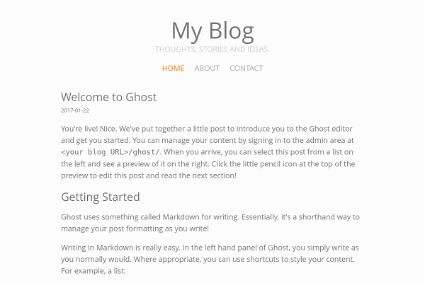

# Ristretto

A minimalist, caffeinated [Ghost](https://ghost.org/) theme.

---

## About

Project page: https://javierrizzo.com/projects/ristretto/

I made this theme for my [ blog ](https://javierrizzo.com/blog/). It is based on
both my [website](https://javierrizzo.com/) and my previous ghost theme,
[Arabica](http://thedarkroast.com/arabica/).


## Screenshot



[View full-page screenshot](img/screenshot-full.png).

## Features

1. **It's minimalist**: Uncluttered so you can focus on reading.
2. **It's responsive**: It can be read just as well on a PC, a tablet, or a
smartphone.
3. **It's fast**: That's what I mean when I call it *caffeinated*. It contains
as little CSS and JS as possible without compromising usability. Even Google's
[PageSpeed Insights](https://developers.google.com/speed/pagespeed/insights/)
ranks it a solid 100/100.
4. **It has syntax highlighting**: Using [Prism.js](http://prismjs.com/), if you
specify a language on a code block, it will be automatically colored.
5. **It has icons**: Powered by [Font Awesome](http://fontawesome.io/).
6. **It's easily extensible**: Ads and comment sections can be added easily
without having to edit the theme code.

## Installation

Just clone the repo into your `content/themes/` directory and restart Ghost.

## Extensibility

### Adding comments

To add <a href="https://disqus.com/">Disqus</a> comments, just add

```
<script>
window.disqus_user = 'YOUR_USER';
</script>
```

on the head code injection section of your Ghost settings, where `YOUR_USER` is
the name of your Disqus account.

### Adding ads

This is a little trickier as it depends on the ad service you're using, but
basically there's a `div` with the `insert-ad` class between each post on the
frontpage, or on the top of a post page, so you can easily make a footer
code-injection script to insert the ads on them.

## License

###The MIT License

Copyright (c) 2017 Javier Rizzo

Permission is hereby granted, free of charge, to any person obtaining a copy
of this software and associated documentation files (the "Software"), to deal
in the Software without restriction, including without limitation the rights
to use, copy, modify, merge, publish, distribute, sublicense, and/or sell
copies of the Software, and to permit persons to whom the Software is
furnished to do so, subject to the following conditions:

The above copyright notice and this permission notice shall be included in
all copies or substantial portions of the Software.

THE SOFTWARE IS PROVIDED "AS IS", WITHOUT WARRANTY OF ANY KIND, EXPRESS OR
IMPLIED, INCLUDING BUT NOT LIMITED TO THE WARRANTIES OF MERCHANTABILITY,
FITNESS FOR A PARTICULAR PURPOSE AND NONINFRINGEMENT. IN NO EVENT SHALL THE
AUTHORS OR COPYRIGHT HOLDERS BE LIABLE FOR ANY CLAIM, DAMAGES OR OTHER
LIABILITY, WHETHER IN AN ACTION OF CONTRACT, TORT OR OTHERWISE, ARISING FROM,
OUT OF OR IN CONNECTION WITH THE SOFTWARE OR THE USE OR OTHER DEALINGS IN
THE SOFTWARE.
